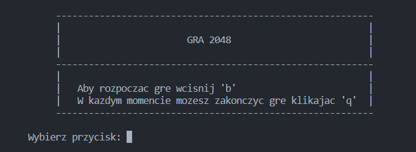
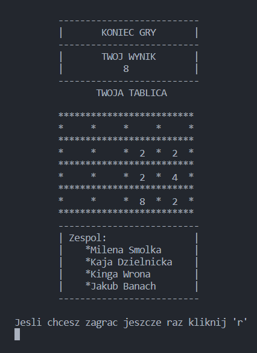

# Game 2048
 Project created with group GitY on I semester 

 

## Spis treści 

* [Informacje o projekcie](#informacje-o-projekcie)  

* [Etapy pracy](#etapy-pracy) 

* [Wygląd aplikacji](#wyglad-aplikacji) 

* [Udoskonalenia projektu](#udoskonalenia-projektu)  

* [Użyte programy](#użyte-programy) 

* [Autorzy](#autorzy-projektu) 

* [Licencja](#licencja) 

## Informacje o projekcie 
Projekt powstał w ramach przedmiotu Narzędzia Informatyczne. Jego realizacja odbyła się w semestrze zimowym roku akademickiego 2021/22. Głównym celem było stworzenie gry, która opiera się na działaniach matematycznych. Poszczególne etapy były realizowane z użyciem różnego rodzaju programów i narzędzi, z których powszechnie korzysta się w środowiskach związanych z projektami informatycznymi.  

## Etapy pracy  
- opracowanie założeń projektu (pomysł, sposób i narzędzia realizacji) 
- praca nad kodem 
- opracowanie warstwy graficznej 
- faza testów 

## Wygląd aplikacji 
Początkowy ekran 
 
Wygląd gry 
  
Końcowy ekran 
  

## Udoskonalenia projektu  
W przyszłości przewidujemy pracę nad udoskonaleniem pewnych aspektów naszego projektu, m.in.: 
- optymalizacja aplikacji 
- GUI 

## Użyte programy 
- Git i GitHub 
- Slack 
- Google Drive 
- Overleaf 
- Trello 
- Doodle 
- Google Meet 
- Google Calendar 
- Microsoft Documents  
- VS Code

## Autorzy projektu 
[@NarzeKajka](https://github.com/NarzeKajka)  
[@MilSmo](https://github.com/MilSmo)  
[@kingawr123](https://github.com/kingawr123)  
[@jakubbanach](https://github.com/jakubbanach)

## Licencja 
Ten projekt posiada licencje GNU General Public License v3.0 
